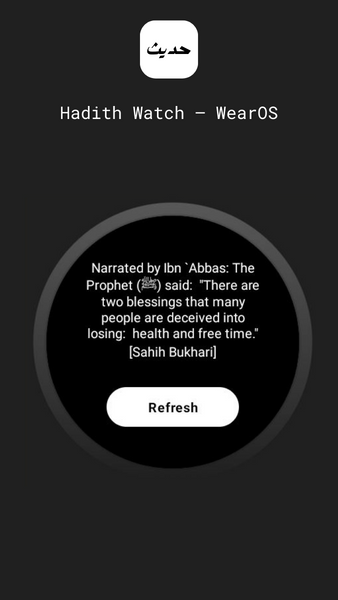
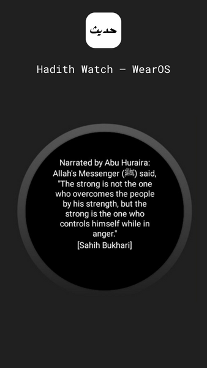

# Hadith Watch WearOS
This is a smartwatch application built for WearOS. It is designed to display a Hadith (quote/narration) to users. 
It contains a refresh button to allow a new hadith to be displayed.

Google Play Store Listing:  [Hadith Watch — WearOS](https://play.google.com/store/apps/details?id=com.hadithwatch.hadithreminderwearos).

## Built With

* Kotlin
* Jetpack Compose
* Built in Android Studio

## Hadith-Watch-WearOS

  
&nbsp; &nbsp; &nbsp; &nbsp;
  

## Goals
* ~~Publishing application on the Google Play Store~~ [Completed]
* Developing an iOS version of the application using Swift or Flutter

## License

This project is licensed under the MIT License
